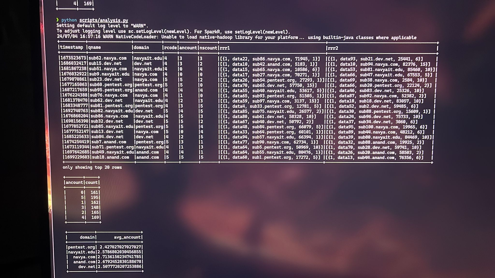

# NetSecAnalyzer

__Welcome to NetSecAnalyzer, a data analysis project for detecting DNS tunneling events using Spark and Python.__

**Project Overview**

NetSecAnalyzer analyzes DNS traffic data to identify potential DNS tunneling events. It leverages Apache Spark for scalable data processing and provides functionalities for data exploration, anomaly detection, and trend analysis.

An example of how the data will look like:

## __Important Note Before Getting Started__
>**Remove all the files from `/data/raw` && `/data/processed` if you are changing any code from `/scripts`**
## **Getting Started**
### **Prerequisites**
1. JDK should be installed and should be in envoirnment variable path.
2. Python and Git should be installed 

**Getting Started**

 ### **Clone the Repository:**

  Open your terminal and clone this repository using the following command:
   ```bash
   git clone https://github.com/AmandracOP/NetSecAnalyzer.git
 ```
  
 ### **Update path according to your system and try using absolute paths:**

 I assume you have not changed my project's file structure. If you changed the location, you will need to update the path in the code:

*   You have to change paths in all the files from `/scripts` if you change my directory structure.
*   If you have not changed my directory structure still you might need to change path(use absolute paths only) in `/notebooks`.

 ### **Create and Activate Python Virtual Environment:**
 It's recommended to create a virtual environment to isolate project dependencies. Here's an example using `venv`:
```bash 
python -m venv navvenv
source navvenv/bin/activate  # For Linux/macOS
navvenv\\Scripts\\activate.bat  # For Windows
```
 ### **Install Dependencies:**
  Activate your virtual environment and install the required packages listed in `requirements.txt`:

```bash
pip install -r requirements.txt
```
**Note**
An example of absolute path
Absolute Path=/home/navarch/DNS-analysis-datascience/environment/requirements.txt